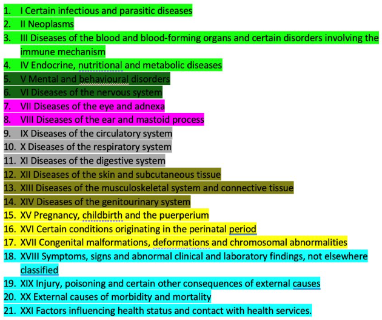
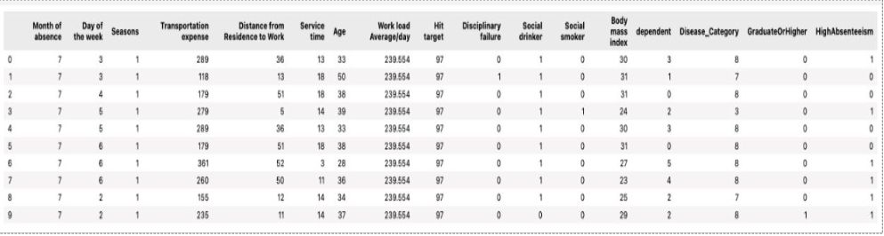
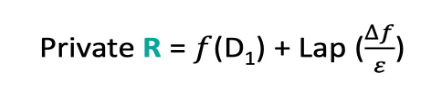
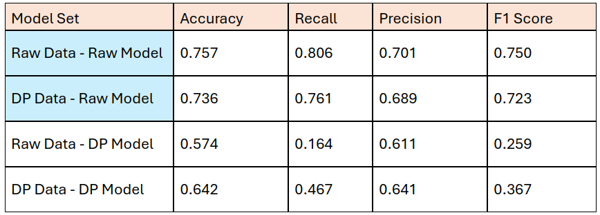
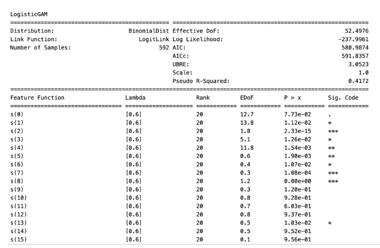
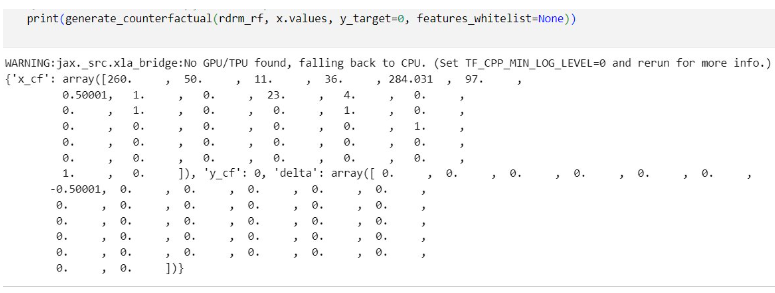

# **Topic: Responsible AI for Predictive Modeling of Employee Absenteeism**

**Overview:**
1. Designed and deployed a predictive AI model for absenteeism forecasting, ensuring ethical data usage, transparency, and fairness to protect employee privacy and promote trust.
2. Integrated responsible AI practices by implementing bias mitigation techniques and continuous monitoring, ensuring the model's decisions supported equitable workforce planning and well-being initiatives.

---------------------------------------------------------

**Project Explanation:**

### 1. Objective
The main objective of this project was to address employee absenteeism through responsible AI modeling. By developing a predictive model, we aimed to:
- Forecast absenteeism to enhance workforce planning and resource optimization.
- Reduce disruptions to service delivery and improve overall business performance.
- Ensure employee well-being through proactive measures.

### 2. Understanding the Dataset
- **Source:** The dataset was sourced from the UCI Machine Learning Repository, containing multi-variate time-series data from a courier company in Brazil, spanning three years.
- **Features:** The dataset included various features such as demographics, job-related attributes, and health information.

### 3. Data Preprocessing and Feature Engineering
- **Composite Features:** Combined features like 'pet' and 'son' into a single 'dependent' feature.
- **Categorical Conversion:** Simplified education status into graduate and non-graduate classes.
- **Grouping:** Reduced 21 disease categories into 8 by grouping similar diseases.

- **Correlation-Based Feature Removal:** Removed highly correlated features, retaining BMI while excluding height and weight.
- **One-Hot Encoding:** Converted categorical features into a one-hot representation for model compatibility.

#### Final dataset after feature engineering:

### 4. Enhancing Data Privacy
- **Differential Privacy (DP):** Implemented differential privacy by adding noise to protect data privacy while maintaining data utility.
- **Privacy by Design:** Ensured data minimization, purpose limitation, and technical and organizational security.
- **DP Implementation:** Applied DP on data, the model, and both, to compare effectiveness.

### 5. Model Development and Comparison
- Developed four model sets and evaluated them based on accuracy, recall, precision, and F1 score:

  - **Raw Data - Raw Model:** Highest accuracy but no privacy.
  - **DP Data - Raw Model:** Slight drop in accuracy but improved privacy.
  - **Raw Data - DP Model:** Significant drop in performance due to noise in the model.
  - **DP Data - DP Model:** Balanced approach with moderate performance and enhanced privacy.

### 6. Explainability and Fairness
- **Explainability:** Used techniques to provide clear and understandable explanations of the model's decisions, ensuring transparency and interpretability.
- **Generalized Additive Models (GAMs):** Implemented for better interpretability.

- **Counterfactual Fairness:** Applied Additive Counterfactual Fairness (ACF) to ensure fairness, focusing on sensitive features like 'Age' and 'BMI'.

### 7. Challenges Faced
- **Balancing Privacy and Performance:** Maintaining data utility while ensuring privacy through differential privacy.
- **Feature Engineering:** Simplifying and grouping features without losing critical information.
- **Ensuring Fairness:** Implementing fairness measures to avoid biased predictions.

### 8. Interesting Findings
- The trade-off between privacy and model performance was a key insight. Adding noise to ensure privacy led to a drop in accuracy, highlighting the importance of balancing these aspects.
- Grouping similar diseases into fewer categories simplified the model without significant loss of information, improving model efficiency.

### 9. Conclusion
- The responsible AI modeling approach resulted in a fair, transparent, and interpretable model for predicting employee absenteeism.
- Proactive measures for high-absenteeism employees were recommended to mitigate business disruptions.
- Incorporating CAPA (Corrective and Preventive Actions) ensured ongoing improvement in absenteeism management, enhancing business resilience and employee well-being.

### 10. Future Work
- Explore advanced privacy-preserving techniques to further balance accuracy and privacy.
- Implement the model in real-time scenarios for continuous improvement.
- Extend the model to other industries with similar absenteeism issues.

------------------

