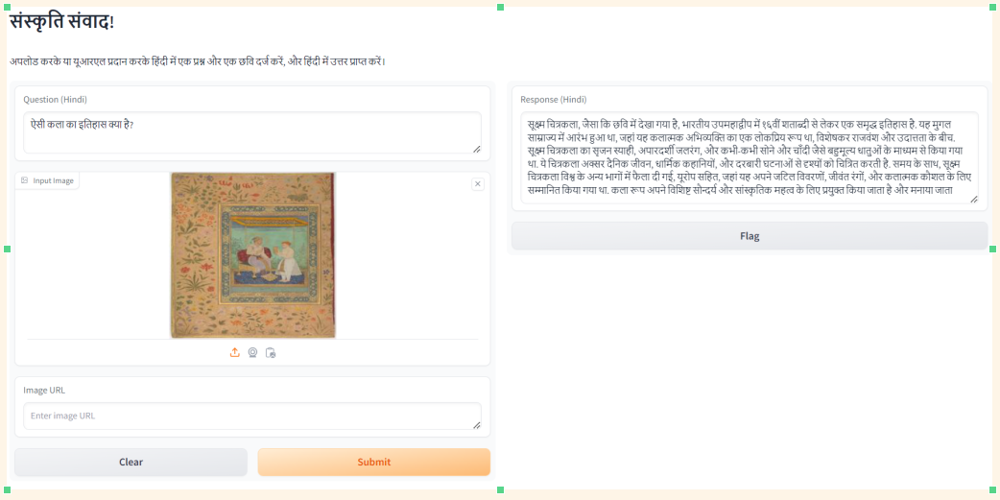
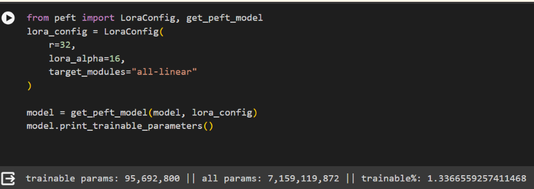
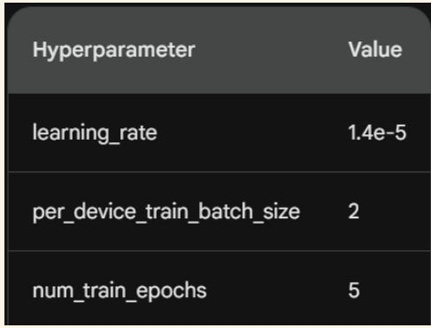

# Sanskriti Samvaad: Unveiling Museum Stories with AI

**Project Overview:**
 - Developed and Integrated AI for Enhanced Museum Experiences: Successfully developed and implemented Sanskriti Samvaad, an AI-powered system utilizing the fine-tuned LLaVA model (llava-1.5-7b-hf-ft-museum), to enable users to explore and understand museum artifacts through image-based queries, significantly enriching visitor interaction and educational engagement.

 - Leveraged Advanced Machine Learning Techniques: Conducted extensive fine-tuning of the LLaVA model using a diverse museum artifact dataset, incorporating techniques such as data augmentation and hyperparameter tuning, resulting in a robust AI system capable of delivering accurate and informative responses based on user-submitted artifact images.

------

## Project Description

Sanskriti Samvaad is an AI-powered project designed to enrich museum experiences by enabling users to explore and comprehend museum artifacts through image-based queries. Leveraging the fine-tuned LLaVA model (llava-1.5-7b-hf-ft-museum), the system generates informative responses based on user queries and corresponding artifact images.

## Key Features

- **Image-based Querying:** Users can upload images of museum artifacts and pose related questions.
- **LLaVA-powered Responses:** The system employs the fine-tuned LLaVA model to interpret images and provide informative responses.

## Model Description (llava-1.5-7b-hf-ft-museum)

The llava-1.5-7b-hf-ft-museum model is a refined iteration of the LLaVA model (llava-hf/llava-1.5-7b-hf), specifically tailored to museum artifact data.

## Steps Involved
1. **Project Planning and Requirement Analysis:**
   - Defined project scope, objectives, and key features.
   - Identified the dataset and relevant artifacts for training the AI model.

2. **Data Collection and Preparation:**
   - Collected a diverse dataset of museum artifact images and metadata.
   - Performed data cleaning, annotation, and augmentation to enhance model training quality.

3. **Model Selection and Fine-Tuning:**
   - Selected the LLaVA model (llava-hf/llava-1.5-7b-hf) as the base model.
   - Fine-tuned the model specifically for museum artifacts (llava-1.5-7b-hf-ft-museum) using techniques such as data augmentation and hyperparameter tuning.

4. **Development and Integration:**
   - Developed the application interface allowing users to upload images and ask questions.
   - Integrated the fine-tuned LLaVA model to generate responses based on image and query inputs.

5. **Testing and Validation:**
   - Conducted rigorous testing to evaluate model performance using training and evaluation datasets.
   - Analyzed metrics to ensure accuracy, relevance, and comprehensiveness of responses.

6. **Deployment and User Feedback:**
   - Deployed the system in a real-world museum environment.
   - Collected and analyzed user feedback to identify areas for improvement.

## Intended Uses & Limitations

### Intended Uses:
- Enhance museum visitor experiences through interactive exploration via image-based queries.
- Aid researchers and curators in retrieving information from museum artifacts.
- Democratize access to museum knowledge by catering to a broader audience.

### Limitations:
- Model accuracy is contingent upon the quality and relevance of the training data.
- Complexity or novelty of queries may challenge the system.
- Manage user expectations regarding response comprehensiveness and factual accuracy.

## Additional Information

## Framework Versions

- PEFT 0.10.0
- Transformers 4.40.1
- Pytorch 2.1.2
- Datasets 2.18.0
- Tokenizers 0.19.1

## Disclaimer

This project is subject to the limitations of the AI model used and the ongoing nature of development. Users should be aware of potential inaccuracies and the evolving state of the project.
